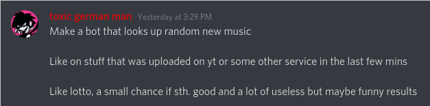

# Neumusic

A Discord bot that looks up random new music from YouTube... for now ;).

# Idea



# Commands

## Recommendations (WIP)

**NOTE**: Buggy, feel free to make PRs or Issues.

```sh
nm!recommend <REGION CODE (Alpha 2)> <next / prev>

# Examples
## Get recommendation in 'US' as region code
nm!recommend US

## Get recommendation in 'DE' as region code, and nextPageToken
nm!recommend DE next

## Get recommendation in 'DE' as region code, and prevPageToken
nm!recommend DE prev
```

## Music Player (WIP)

**Note**: Extremely buggy!

```sh
nm!play <YouTube URL>

# Music Commands
nm!pause
nm!resume
nm!stop

# Disconnect the Bot from VC.
nm!disconnect
```
